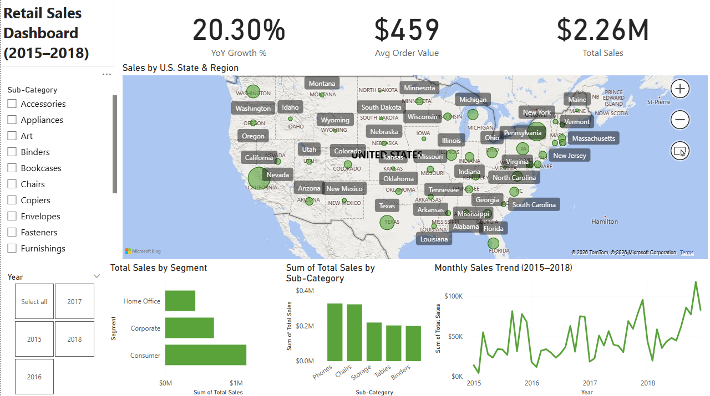

# Retail Sales Power BI Dashboard

Power BI dashboard analyzing retail sales trends across U.S. states (2015–2018).

## Dashboard Preview

## Tools Used
Power BI  
DAX

## Key Insights
Sales increased over time.
Consumer segment dominates sales.
Phones and chairs lead product categories.
